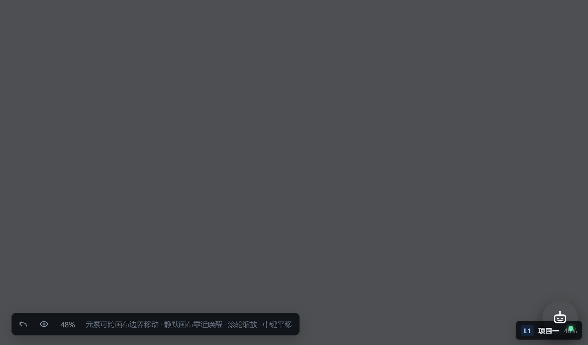
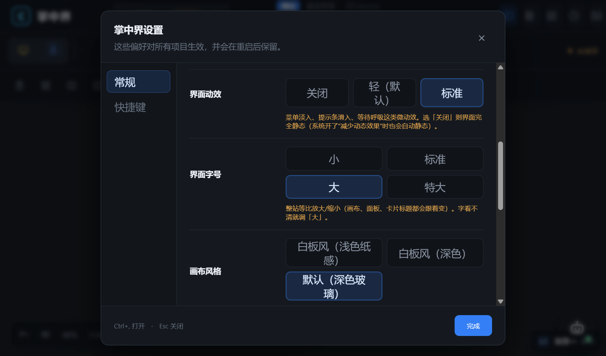

# 掌中界

把**网页、文件夹、便签**当成一张张草纸，铺在一张无限大的桌布上 —— Windows 桌面上的空间工作台。

> 你不需要在十几个窗口之间 Alt+Tab。把要用的东西摊开放着，鼠标推过去、拖过来、推开挡路的、随手贴张便签，
> 一屏之内就是你这一刻的工作现场。

- 平台：Windows 10 / 11（x64）
- 技术栈：C++ 宿主 + WebView2 + React 19 / TypeScript / Vite
- 体积：安装包约 47 MB（自带 WebView2 运行时与离线 OCR，装完直接能用）
- 许可：MIT




## 它解决什么

桌面上的信息通常散在三种地方：浏览器标签页、资源管理器窗口、便签纸。掌中界把这三样做成同一种"卡片"，
放在同一张可以随意缩放的画布上：

- 想对比两个文件夹？两张文件夹卡片并排摊开，直接拖文件进出（用的是真实 Windows Shell 文件视图，右键菜单、拖放都是原生的）。
- 边查资料边写东西？一张网页卡片 + 一张便签卡片，摆在手边，不用切窗口。
- 一个主题摊开成一屏？把相关的东西放进一张子画布，再吸附出下一层，最多三层嵌套，导航器里一眼看清结构。
- 这一屏摆好之后，存成模板，下次一键铺开。

## 主要功能

**画布**
- 无限画布，中键平移、滚轮以指针为中心缩放；最多三层嵌套子画布，元素可以一次拖拽跨层（`L3 → L2 → L1`）
- 靠近自动"水滴吸附"成子画布；两张画布靠近或选中后融合成一张大画布
- 框选、`Shift` 多选、成组 / 解组、二分屏 / 三分屏 / 四宫格 / 主次布局，分隔条可拖动改比例
- 双击画布标题栏在工作区内最大化，四条边线往里拖可以直接创建分屏
- 空间导航器：显示所有画布的父子关系、层级、元素数量和缩放比例

**卡片**
- 便签（可贴图）、参考图板、网页（独立 WebView2，可强制深色 / 跟随应用 / 网站原色）、
  文件夹（原生 Shell 视图）、应用门户、子画布
- 卡片可弹出并置顶，置顶内容不随画布移动

**推开草纸（白板风专属手感）**
- 拖着卡片走，挡路的卡片会**按你推的方向**让开，让开就是让开了，不会自己弹回去
- 手停住它就不动；换方向推，另一侧的卡片往另一侧让；被让开的卡片在整个手势里不参与对齐 / 吸附
- `Ctrl + 拖标题栏` = 拖出一份副本，原件和旁边的卡片都不动

**外观与易用**
- 三种画布风格：白板风（浅色纸感）/ 白板风（深色）/ 深色玻璃
- 界面字号四档（小 / 标准 / 大 / 特大），整站等比缩放
- 系统边框 / 无边框、云母半透明 / 实色，主题跟随系统
- 内置使用手册，空画布上有新手引导

**窗口协作与系统集成**
- 与外部程序分屏（左 / 右 / 上 / 下）、贴靠布局面板、平铺多个窗口
- 区域截图 / 全屏截图 / 微信式截图工具（标注、长截图、取色），落进"剪贴暂存"
- 超级预览（`Space`）：目录树 + 收藏 + 打开位置，图片、视频、压缩包都能看
- 离线 OCR（自带引擎，中英识别；韩文走系统引擎）
- `.zzj` 项目文件夹与 `.zzjx` 导出包的文件关联，双击直接进掌中界

## 下载安装

到 [Releases](/releases) 下载最新的 `ZhangZhongJie-Setup-<版本>-x64.exe`：

- **免管理员**：默认装到 `%LOCALAPPDATA%\Programs\掌中界`，不写系统目录、不装驱动或服务
- 自带 WebView2 运行时；安装时可在可选步骤重新勾选
- 你的数据在 `%LOCALAPPDATA%\掌中界\`（模板 / 会话 / 设置），与程序分开放，覆盖升级不丢
- 卸载：设置 → 应用 → 掌中界，或用安装目录里的 `unins000.exe`

## 30 秒上手

1. 空白处**右键** → 新建便签 / 网页 / 文件夹
2. 鼠标移到卡片上，上方浮出**标题栏** → 按住就能拖（`Ctrl + 拖` 是复制一份）
3. 左栏点**「模板」**可以把当前这屏存下来，下次一键铺开

更完整的说明在安装目录里的 `使用手册.html`（开始菜单里也有）。

## 常用快捷键

| 快捷键 | 作用 |
|---|---|
| `Ctrl+,` | 打开设置 |
| `Ctrl+K` | 聚焦顶栏搜索 |
| `Ctrl+Shift+W` | 添加网页卡片 |
| `Ctrl+Shift+E` | 打开"此电脑"（原生文件视图） |
| `Ctrl+Shift+A` | 按类型整理当前画布 |
| `Ctrl+Shift+L` | 显示 / 隐藏空间导航器 |
| `Ctrl+G` | 成组 / 解组 |
| `Space` | 超级预览（图片 / 视频 / 文件） |
| `Ctrl+Shift+Left / Right` | 与外部程序左右分屏 |
| `Ctrl+Up / Down` | 与外部程序上下分屏 |
| `Ctrl+Shift+Z` | 贴靠布局面板 |
| `Ctrl+Alt+S` | 区域截图（全局生效） |
| `Alt+A` | 截图工具：标注 / 长截图 / 取色（全局生效） |
| `Ctrl+Z / Ctrl+Y` | 撤销 / 重做 |
| `Ctrl+S` | 保存 |

设置 → 快捷键 里可以改，也可以看全部分组（文件列表、网页卡片、超级预览等都有独立的一组）。

## 从源码构建

需要：Windows 10/11、Node.js 20+、Visual Studio 2022（"使用 C++ 的桌面开发"工作负载 + Windows SDK）。

```powershell
# 前端（React + Vite）
npm install
npm run dev            # 开发服务器
npm run build          # 生产构建

# 原生宿主（C++ + WebView2）
npm run desktop:build  # 首次会把 WebView2 SDK 下到项目的 .packages/，不污染全局
npm run desktop:run    # 直接跑起来
```

打包安装器需要 [Inno Setup 6](https://jrsoftware.org/isdl.php)，脚本在 `installer/`：

```powershell
# 编译 + 发布（Windows 下用 Git Bash 跑）
bash installer/pack.sh <新版本> <旧版本> <使用说明片段.md>

# 生成一个"发同事测试"的压缩包
bash installer/make-test-package.sh <版本>
```

## 项目结构

```
src/                前端（WebView2 里的界面）
  App.tsx           画布与卡片的主体逻辑
  styles.css        主题变量与三套皮肤
  shortcuts.ts      快捷键定义（设置面板里改的就是这里）
native/             C++ 宿主
  main.cpp          窗口、WebView2、原生 Shell 文件视图、截图、OCR、与前端通信
  build.ps1         MSBuild 构建
installer/          Inno Setup 安装器脚本、打包脚本、使用手册
tools/              截图工具、图标生成、离线 OCR 等辅助程序
docs/               截图与文档
```

## 已知限制

- 只支持 Windows（依赖 WebView2 与 Windows Shell）
- 网页卡片是独立的 WebView2 环境，首次从旧版本升级后网页账号需要重新登录一次
- 原生 Shell 文件夹卡片在同一时间由系统限制，数量多了会吃内存
- 最多三层嵌套画布（再深一层没有意义，也拖不动）
- **仓库里不含 `tools/ScreenCapture.exe`、`tools/ImageReader.exe` 等辅助工具的源码**（它们是独立小工具）。
  只 clone 仓库能构建出掌中界本体，但「区域截图 / 截图工具 / OCR 取字」需要安装包里附带的二进制，详见 `tools/README.md`

## 第三方组件与许可

| 组件 | 用途 | 许可 |
|---|---|---|
| Microsoft Edge WebView2 | 承载界面与网页卡片 | 随 Windows 分发（可再分发运行时） |
| RapidOCR-json | 离线 OCR 引擎 | Apache-2.0 |
| React / Vite / TypeScript / marked / DOMPurify | 前端 | MIT 等开源许可 |

本仓库不包含上述第三方组件的二进制文件；安装包里的 WebView2 运行时与 OCR 引擎来自它们的官方发布。

## 许可

[MIT](LICENSE)

---

**English**: *ZhangZhongJie* is a spatial desktop workspace for Windows — web pages, folders and sticky notes
live as cards on one infinite canvas you can pan and zoom, push aside, nest into sub-canvases and save as templates.
Built with a native C++ host + WebView2 + React. Windows 10/11 only, MIT licensed.
